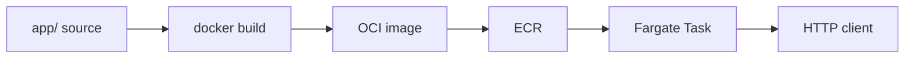

# Deployment Architecture — `hello-app`

## Papel no lab

```text
[Código em app/]
      |
      |  docker build (context=./app)
      v
[Imagem local hello-fargate:latest]
      |
      |  docker push (script tooling)
      v
[ECR hello-fargate] ---- pull ----> [Task Fargate :8000]
                                      |
                                      v
                                 Cliente HTTP
```

## Dockerfile (contrato)

| Aspecto | Valor |
|---|---|
| Base | `python:3.12-slim` (`ARG PYTHON_VERSION=3.12`) |
| User | não-root |
| EXPOSE | 8000 |
| CMD | `uvicorn main:app --host 0.0.0.0 --port 8000` |
| HEALTHCHECK | ausente |
| Build | `docker build -t $ECR_URI:latest ./app` |

## Diagrama Mermaid



## Alternativa em texto
Fonte `app/` → build Docker → push ECR → task Fargate → cliente HTTP na porta 8000.
