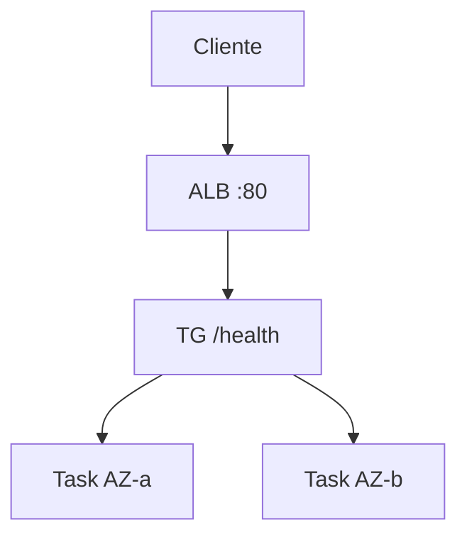

# Deployment Architecture — `hello-infra` Fase 2

## Fluxo de request

```text
Internet
   ↓
ALB hello-fargate-alb (:80)  [2 AZs]
   ↓
TG hello-fargate-tg (ip:8000, HC GET /health)
   ↓
ECS Service desired=2
   ├── Task AZ-a (subnet 10.0.1.0/24)
   └── Task AZ-b (subnet 10.0.2.0/24)
```



## Outputs oficiais (Q5=B)
| Output | Uso |
|---|---|
| `alb_dns_name` | Fluxo lab principal: `curl http://<dns>/` |
| `alb_arn` / `target_group_arn` | Debug / console |
| IP da task (CLI/script) | Caminho **oficial alternativo** (além do ALB), para comparação didática Fase 1 vs 2 |

## Operação
1. `terraform apply` (possível replace de rede)
2. `build-and-push.ps1` + force deployment
3. Validar via DNS ALB **e** opcionalmente IP da task
4. Exercício: stop 1 task → self-healing
5. `terraform destroy`
