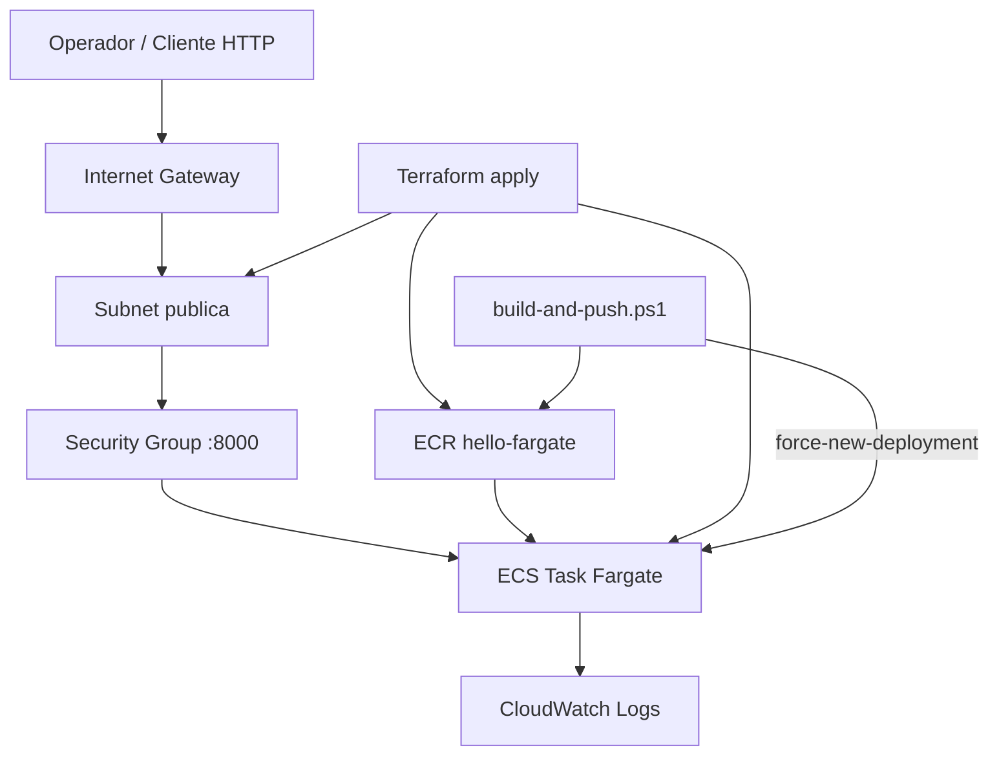

# Deployment Architecture — `hello-infra`

## Visão do ambiente (lab)

```text
Internet
   |
   |  TCP 8000 (allowed_cidr)
   v
[ENI com IP público] ---- Task Fargate (ApiApp :8000)
   |                           |
   |                           +--> awslogs --> /ecs/hello-fargate
   |
[Subnet pública 10.0.1.0/24] -- RT --> IGW --> Internet
   |
[VPC 10.0.0.0/16]  (1 AZ via data.aws_availability_zones[0])

[ECR hello-fargate:latest] <-- pull pela task (execution role)
                         ^
                         | docker push (Tooling, após terraform apply)
```

## Fluxo de deploy (operacional)

```text
1. aws sso login
2. cd infra && terraform init && terraform apply
   - Cria rede, ECR, IAM, logs, cluster, task def, service
   - Service pode falhar até existir imagem
   - Output tenta public_ip (híbrido); senão usar CLI
3. scripts/build-and-push.ps1
   - build/tag/push :latest
   - aws ecs update-service --force-new-deployment
4. Validar curl http://<IP>:8000/ e /health
5. terraform destroy (+ limpeza ECR se necessário)
```

## Diagrama Mermaid



## Alternativa em texto
- Cliente → IGW → subnet pública → SG → Task Fargate
- Task puxa imagem do ECR e envia logs ao CloudWatch
- Terraform cria a base; script publica imagem e força novo deployment

## Notas didáticas
- **Por que subnet pública + assign_public_ip**: lab sem NAT/ALB; task precisa puxar ECR e receber tráfego direto.
- **Por que 1 AZ**: custo e simplicidade; HA fora de escopo.
- **Por que IP pode mudar**: ENI da task é efêmera; por isso output híbrido + CLI fallback.
