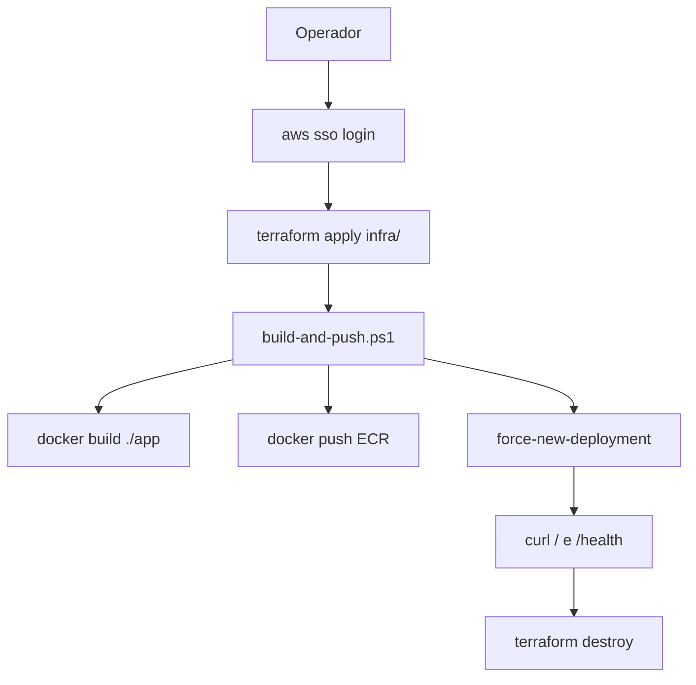

# Deployment Architecture — `hello-tooling-docs`

## Papel operacional

```text
[Operador]
   |  aws sso login
   |  terraform -chdir=infra apply
   |  scripts/build-and-push.ps1  (lê outputs de ./infra, build ./app)
   |  curl http://<IP>:8000/  e  /health
   |  terraform -chdir=infra destroy
   v
[Lab completo / custo ~zero]
```

## Resolução de caminhos no script
1. Determinar diretório do script (`$PSScriptRoot`)
2. Raiz do repo = parent de `scripts/`
3. `InfraDir` = `<raiz>/infra`
4. `AppDir` = `<raiz>/app`

## Diagrama Mermaid



## Alternativa em texto
SSO → apply → script (build/push/redeploy) → validação HTTP → destroy.
