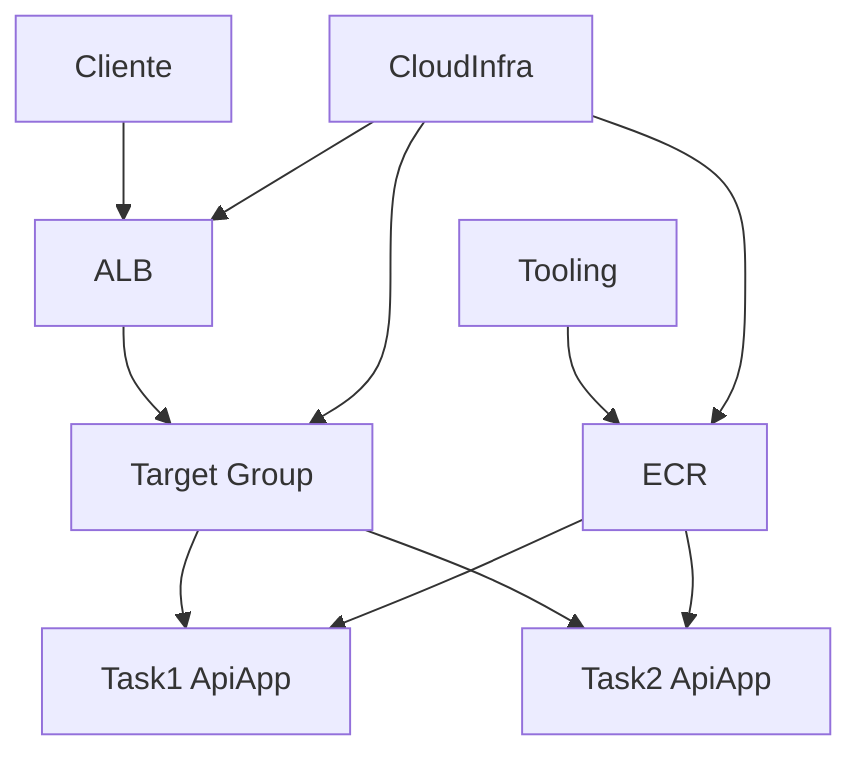

# Component Dependency — Fase 2

## Diagrama

```text
[Cliente HTTP]
      |
      v
   [ALB]  ---- SG alb :80
      |
      v
[Target Group + HC /health]
      |
      +----> [Task 1 ApiApp]  -- SG task :8000 (só do SG alb)
      +----> [Task 2 ApiApp]
                ^
                | imagem
             [ECR] <--- [Tooling build-and-push]
                ^
                | provisiona
           [CloudInfra / Terraform]
```



## Matriz
| De | Para | Tipo |
|---|---|---|
| Cliente | ALB | runtime HTTP |
| ALB | TG / Tasks | runtime |
| ECS Service | Tasks + TG | runtime control plane |
| Tooling | ECR / ECS | ops |
| Terraform | todos recursos AWS | provision |
| ApiApp | — | sem dependência do ALB no código |

## Acoplamento
- App **desacoplada** do ALB (sem headers custom).
- CloudInfra concentra acoplamento ALB↔Service↔SG.
