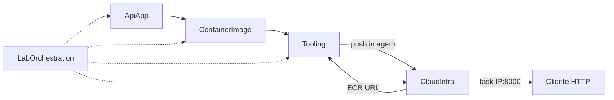

# Dependências e Fluxo de Dados

## Matriz de dependências

| De → Para | Tipo | Motivo |
|---|---|---|
| ContainerImage → ApiApp | build-time | Dockerfile empacota o código da API |
| Tooling → ContainerImage | build-time | Script faz `docker build` |
| Tooling → CloudInfra | runtime/ops | Precisa URL do ECR (output) para push |
| CloudInfra → Tooling/ContainerImage | runtime | ECS Service precisa da imagem **já publicada** no ECR |
| LabOrchestration → todos | conceitual | Coordena a ordem didática |
| Cliente HTTP → ApiApp | runtime | Via IP público da ENI da task (CloudInfra) |

## Fluxo ponta a ponta (texto)

```text
[Desenvolvedor]
    |  (1) sso login
    v
[CloudInfra / terraform apply]
    |  cria VPC, SG, ECR, IAM, ECS Service (pode ficar unhealthy até haver imagem)
    v
[Tooling / build-and-push]
    |  build ContainerImage (ApiApp) -> push ECR
    v
[ECS Task Fargate]
    |  pull imagem, bind 8000, awslogs
    v
[ENI + IP público] --output TF e/ou CLI fallback-->
    v
[Cliente] GET /  e  GET /health
    v
[CloudInfra / terraform destroy]
```

## Diagrama de dependência (Mermaid)



## Alternativa em texto
- ApiApp → ContainerImage → Tooling → (push) → ECR/CloudInfra → Task → Cliente
- LabOrchestration coordena a ordem; não é runtime AWS extra

## Comunicação
- **ApiApp ↔ Cliente**: HTTP síncrono
- **Tooling ↔ AWS**: AWS CLI / Docker API
- **CloudInfra ↔ AWS**: Terraform provider
- **Sem** mensageria, sem service mesh, sem ALB
