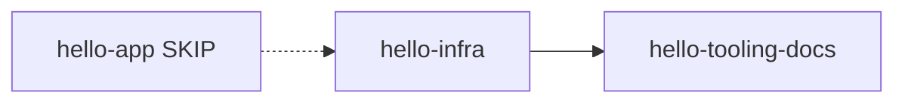

# Dependências entre Unidades — Fase 2

| Unidade | Depende de | Motivo |
|---|---|---|
| `hello-infra` | — (reutiliza imagem ECR/`hello-app` já existente) | Provisiona ALB/Service |
| `hello-tooling-docs` | `hello-infra` (output `alb_dns_name`, cluster/service) | Documenta DNS e fluxo |
| `hello-app` | — | SKIP; já deployável via imagem atual |

## Ordem runtime (didática)
1. `terraform apply` (`hello-infra`)
2. `build-and-push.ps1` (tooling; pode só redeploy se imagem já existe)
3. curl DNS ALB
4. Exercício self-healing
5. destroy

