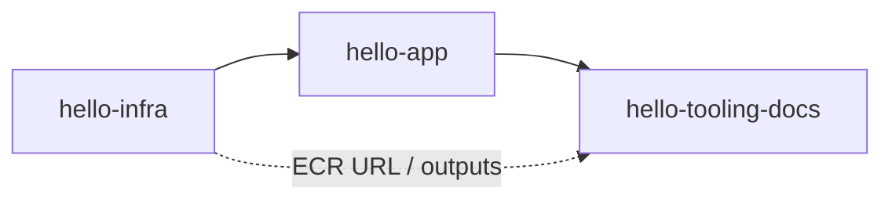

# Dependências entre Unidades de Trabalho

## Ordem de geração (Construction)
```text
hello-infra  -->  hello-app  -->  hello-tooling-docs
```

## Matriz

| Unidade | Depende de | Motivo |
|---|---|---|
| `hello-infra` | — (na geração) | Define ECR URL, rede, ECS; pode referenciar tag de imagem convencionada |
| `hello-app` | Conceitos de `hello-infra` (porta 8000, região) | Imagem deve casar com task definition; geração após infra para alinhar nomes/tag |
| `hello-tooling-docs` | `hello-infra` (outputs ECR/cluster) + `hello-app` (contexto Docker) | Script de push e README usam nomes reais dos recursos |

## Dependência em runtime (lab)
```text
1. terraform apply          (hello-infra)
2. build-and-push.ps1       (hello-tooling-docs + imagem hello-app)
3. service puxa imagem      (hello-infra consome ECR)
4. curl IP:8000             (validação docs)
5. terraform destroy        (hello-infra + checklist tooling)
```

## Diagrama



## Alternativa em texto
- Geração: infra → app → tooling
- Runtime: apply(infra) → push(tooling+app) → validate → destroy(infra)
