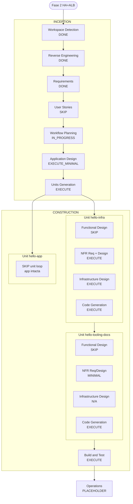

# Plano de Execução — Fase 2 (HA + ALB)

## Resumo da Análise Detalhada

### Escopo
- **Tipo**: Brownfield — evolução da Fase 1 (FastAPI + Fargate sem ALB)
- **Alteração principal**: Terraform multi-AZ + ALB + TG + Service `desired_count=2` + docs/roteiro self-healing
- **App**: **intacta** (FastAPI)
- **Prefixo**: `hello-fargate` · **Região**: `us-east-1`
- **Apply**: in-place (pode exigir replace de rede/SG)

### Avaliação de Impacto
| Área | Impacto |
|---|---|
| User-facing | Sim — acesso passa a ser **DNS do ALB** (não IP da task) |
| Estrutural | Sim — rede 2 AZ, ALB, TG, SGs, service load_balancer |
| Modelo de dados | Não |
| API HTTP | Não (mesmos `/` e `/health`) |
| NFR | Sim — HA didática, self-healing, custo ALB+2 tasks |

### Risco
- **Nível**: Médio–alto (ALB custo, replace de rede in-place, SG mal configurado)
- **Rollback**: `terraform destroy` / reapply Fase 1 patterns
- **Mitigação**: destroy checklist; HC `/health`; SG tasks só do ALB

### Component Relationships
| Componente | Change |
|---|---|
| `infra/` (CloudInfra) | **Major** — network, alb, ecs service |
| `scripts/` + `README` | **Important** — DNS ALB + self-healing |
| `app/` | **None** (reutilizar) |
| `docs/` policy IAM | **Minor** — garantir ações ELB |

## User Stories — PULAR
- Mudança de infra/ops didática; sem novas personas de produto
- Critérios de aceite já cobrem o “acceptance” do lab
- Usuário pode forçar inclusão se quiser

## Visualização do Workflow



### Sequência em texto
```text
INCEPTION (restante):
  User Stories SKIP
  -> Application Design (mínimo: ALB/TG/SG/Service)
  -> Units Generation (hello-infra + hello-tooling-docs; hello-app N/A)

CONSTRUCTION:
  1) hello-infra: NFR -> Infra Design -> Code Gen (Terraform HA/ALB)
  2) hello-tooling-docs: docs/README/script ajustes DNS ALB + self-healing
  3) hello-app: PULAR (sem code gen)
  -> Build and Test (curl ALB + exercício matar task)

OPERATIONS: PLACEHOLDER
```

## Decisões de estágio

### INCEPTION
- [x] Workspace Detection
- [x] Reverse Engineering
- [x] Requirements Analysis
- [x] User Stories — **PULAR**
- [ ] Workflow Planning — EM ANDAMENTO (este doc)
- [ ] Application Design — **EXECUTAR (mínimo)**
- [ ] Units Generation — **EXECUTAR** (2 unidades ativas)

### CONSTRUCTION
| Unidade | FD | NFR | NFR Design | Infra Design | Code Gen |
|---|---|---|---|---|---|
| `hello-infra` | SKIP | EXEC | EXEC | EXEC | EXEC |
| `hello-tooling-docs` | SKIP | MIN | MIN | N/A | EXEC |
| `hello-app` | — | — | — | — | **SKIP** (intacta) |
| Build and Test | EXEC — curl DNS ALB + self-healing + destroy |

### OPERATIONS
- [ ] PLACEHOLDER

## Unidades propostas
| Ordem | Unidade | Conteúdo |
|---|---|---|
| 1 | `hello-infra` | 2 AZ, ALB, TG, HC, Service desired=2, SGs |
| 2 | `hello-tooling-docs` | README/script/policy: DNS ALB + roteiro self-healing |
| — | `hello-app` | Sem regeneração |

## Backlog alinhado aos RFs
1. Rede 2ª subnet/AZ + SGs  
2. ALB + TG + listener :80 + HC `/health`  
3. ECS Service desired=2 + load_balancer  
4. Outputs `alb_dns_name`  
5. README + exercício matar task  
6. Build and Test  

## Extensions
| Extension | Enforcement |
|---|---|
| Security | OFF — skip |
| Resiliency | ON — HA/self-healing; N/A onde escopo exclui |
| PBT | OFF — skip |

## Critérios de sucesso do plano
- Artefatos cobrem RF-F2-01..09
- `curl http://<alb-dns>/` e `/health`
- desired=2 + exercício de recuperação documentado e testável
- Destroy checklist

## Controle do usuário
Você pode **incluir/excluir** estágios (ex.: forçar User Stories, pular Application Design, regenerar app).  
**Nenhuma implementação Terraform** até este plano (e os próximos gates de design) serem aprovados.
