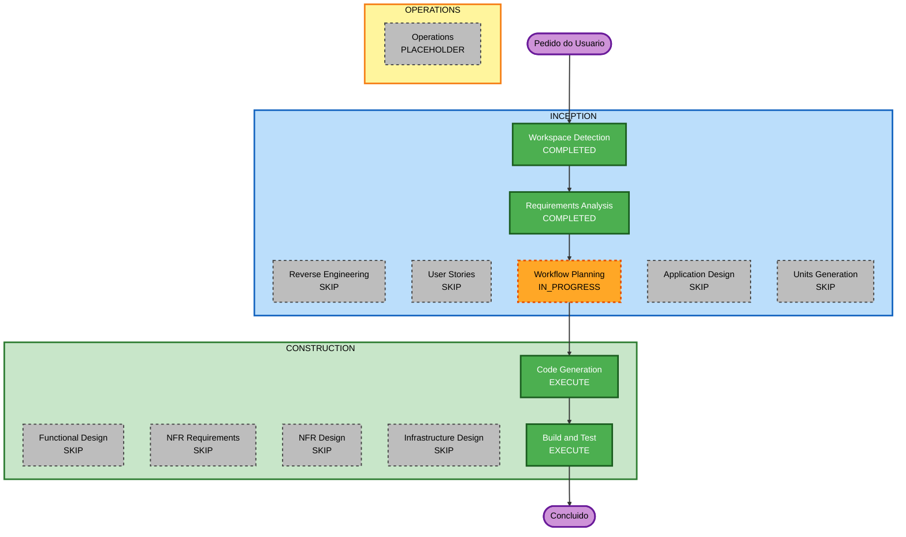

# Plano de Execução

## Resumo da Análise Detalhada

### Escopo da Transformação
- **Tipo**: Documentação (greenfield — sem código de aplicação)
- **Alteração principal**: Criar `README.md` na raiz com guia completo de setup do AI-DLC no Cursor
- **Componentes relacionados**: Nenhum (apenas documentação e artefatos em `aidlc-docs/`)

### Avaliação de Impacto
- **Mudanças voltadas ao usuário**: Sim — desenvolvedores usarão o README para instalar o AI-DLC
- **Mudanças estruturais**: Não
- **Mudanças de modelo de dados**: Não
- **Mudanças de API**: Não
- **Impacto de NFR**: Baixo — precisão e usabilidade do documento (RNF-1 a RNF-4)

### Relacionamentos de Componentes
- Não aplicável (sem código de aplicação)

### Avaliação de Risco
- **Nível de risco**: Baixo
- **Complexidade de rollback**: Fácil (remover/editar `README.md`)
- **Complexidade de testes**: Simples (revisão manual / checklist)

### Idioma
- Todos os artefatos deste fluxo em **português (pt-BR)**, inclusive `aidlc-docs/` e o `README.md`

## Visualização do Workflow

### Diagrama Mermaid



### Alternativa em texto

```
Pedido do Usuario
  -> Workspace Detection (COMPLETED)
  -> Reverse Engineering (SKIP)
  -> Requirements Analysis (COMPLETED)
  -> User Stories (SKIP)
  -> Workflow Planning (IN_PROGRESS)
  -> Application Design (SKIP)
  -> Units Generation (SKIP)
  -> Functional Design (SKIP)
  -> NFR Requirements (SKIP)
  -> NFR Design (SKIP)
  -> Infrastructure Design (SKIP)
  -> Code Generation (EXECUTE)
  -> Build and Test (EXECUTE)
  -> Operations (PLACEHOLDER)
  -> Concluido
```

## Fases a Executar

### INCEPTION
- [x] Workspace Detection (CONCLUÍDO)
- [x] Reverse Engineering (PULADO — greenfield / sem código de aplicação)
  - **Justificativa**: Não há codebase de aplicação para analisar
- [x] Requirements Analysis (CONCLUÍDO)
- [x] User Stories (PULADO — documentação sem impacto de fluxo de usuário de produto)
  - **Justificativa**: Entregável é README de setup; sem personas/jornadas de produto
- [x] Workflow Planning (EM ANDAMENTO — aguardando aprovação)
- [ ] Application Design — PULAR
  - **Justificativa**: Nenhum componente/serviço novo; apenas arquivo Markdown
- [ ] Units Generation — PULAR
  - **Justificativa**: Uma única unidade simples (`readme-ai-dlc-setup`); sem decomposição

### CONSTRUCTION
- [ ] Functional Design — PULAR
  - **Justificativa**: Sem modelos de dados ou regras de negócio complexas
- [ ] NFR Requirements — PULAR
  - **Justificativa**: NFRs já capturados nos requisitos; sem seleção de stack
- [ ] NFR Design — PULAR
  - **Justificativa**: NFR Requirements pulado; sem padrões de NFR a projetar
- [ ] Infrastructure Design — PULAR
  - **Justificativa**: Sem mudanças de infraestrutura/cloud
- [ ] Code Generation — EXECUTAR (SEMPRE)
  - **Justificativa**: Gerar `README.md` + resumo em `aidlc-docs/construction/.../code/`
  - **Unidade**: `readme-ai-dlc-setup`
- [ ] Build and Test — EXECUTAR (SEMPRE)
  - **Justificativa**: Instruções de verificação/checklist do README

### OPERATIONS
- [ ] Operations — PLACEHOLDER
  - **Justificativa**: Etapa futura; não aplicável agora

## Unidade de Trabalho
| Unidade | Descrição | Entregável |
|---|---|---|
| `readme-ai-dlc-setup` | README de pré-requisitos e setup do AI-DLC no Cursor | `README.md` (raiz) |

## Sequência de Pacotes
- Não aplicável (greenfield sem módulos de aplicação)

## Linha do Tempo Estimada
- **Etapas restantes a executar**: 2 (Code Generation, Build and Test)
- **Duração estimada**: curta (uma sessão)

## Critérios de Sucesso
- **Objetivo principal**: README em português com guia completo de setup do AI-DLC
- **Entregáveis-chave**:
  - `README.md` na raiz
  - Artefatos de plano/geração em português sob `aidlc-docs/`
  - Instruções de verificação em Build and Test
- **Quality gates**:
  - Conteúdo alinhado a `requirements.md`
  - Comandos PowerShell fiéis ao setup do usuário
  - Checklist e troubleshooting presentes

## Compliance de Extensions (neste plano)
| Extension | Status | Notas |
|---|---|---|
| Security Baseline | N/A (desabilitada) | Opt-out nos requisitos |
| Resiliency Baseline | N/A (desabilitada) | Opt-out nos requisitos |
| Property-Based Testing (Partial) | N/A | Sem funções puras/serialização neste entregável de documentação |
