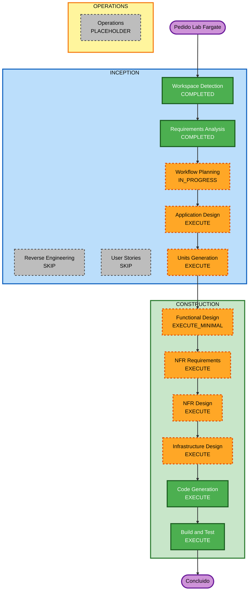

# Plano de Execução — Lab FastAPI + Fargate + Terraform

## Resumo da Análise Detalhada

### Escopo
- **Tipo**: Greenfield de aplicação + IaC (workspace já tem AI-DLC e policy IAM de estudo)
- **Alteração principal**: App Hello World, container, ECR, rede mínima, ECS/Fargate (1 task via Service), scripts e README didático
- **Prefixo AWS**: `hello-fargate` · **Região**: `us-east-1`

### Avaliação de Impacto
- **User-facing**: Sim — HTTP público na porta 8000 (estudo)
- **Estrutural**: Sim — novos diretórios `app/`, `infra/`, `scripts/`
- **Modelo de dados**: Não
- **API**: Sim — `GET /` e `GET /health`
- **NFR**: Sim — custo, didática, logs, resiliência (Low), destroy obrigatório

### Risco
- **Nível**: Médio (conta AWS real, IP público, custo se esquecer destroy)
- **Rollback**: Fácil — `terraform destroy` + re-push
- **Testes**: Simples (curl + checklist)

### Idioma
- Português (pt-BR) em docs, comentários Terraform e `aidlc-docs/`

## Visualização do Workflow

### Diagrama Mermaid



### Alternativa em texto

```
Pedido
  -> Workspace Detection (COMPLETED)
  -> Reverse Engineering (SKIP)
  -> Requirements Analysis (COMPLETED)
  -> User Stories (SKIP)
  -> Workflow Planning (IN_PROGRESS)
  -> Application Design (EXECUTE)
  -> Units Generation (EXECUTE)
  -> Functional Design (EXECUTE minimal, por unidade)
  -> NFR Requirements (EXECUTE)
  -> NFR Design (EXECUTE)
  -> Infrastructure Design (EXECUTE)
  -> Code Generation (EXECUTE, por unidade)
  -> Build and Test (EXECUTE)
  -> Operations (PLACEHOLDER)
  -> Concluido
```

## Fases a Executar / Pular

### INCEPTION
- [x] Workspace Detection — CONCLUÍDO
- [x] Reverse Engineering — PULADO (sem codebase de app)
- [x] Requirements Analysis — CONCLUÍDO / APROVADO
- [ ] User Stories — **PULAR**
  - **Justificativa**: Lab técnico individual; critério de sucesso já é o acceptance criteria; sem múltiplas personas
- [ ] Workflow Planning — EM ANDAMENTO (este documento)
- [ ] Application Design — **EXECUTAR**
  - **Justificativa**: Novos componentes (API, container, scripts, módulos Terraform) e dependências a esclarecer
- [ ] Units Generation — **EXECUTAR**
  - **Justificativa**: Decomposição em unidades `app`, `infra`, `tooling-docs`

### CONSTRUCTION (por unidade, na ordem abaixo)
- [ ] Functional Design — **EXECUTAR (mínimo)** na unidade `app`; N/A ou mínimo nas demais
- [ ] NFR Requirements — **EXECUTAR** (custo, logs, resiliência Low, destroy)
- [ ] NFR Design — **EXECUTAR** (padrões mínimos alinhados às decisões Resiliency)
- [ ] Infrastructure Design — **EXECUTAR** (mapeamento VPC/ECR/IAM/ECS → recursos Terraform)
- [ ] Code Generation — **EXECUTAR** (sempre)
- [ ] Build and Test — **EXECUTAR** (sempre) — instruções locais + checklist AWS

### OPERATIONS
- [ ] Operations — PLACEHOLDER (destroy/checklist ficam no README + Build and Test)

## Unidades propostas (para Units Generation)

| Ordem (geração) | Unidade | Conteúdo | Depende de |
|---|---|---|---|
| 1 | `hello-infra` | Terraform em `infra/` (network, ecr, iam, ecs, variables, outputs) | — |
| 2 | `hello-app` | FastAPI, `requirements.txt`, Dockerfile | Alinhamento com task/porta/tag |
| 3 | `hello-tooling-docs` | `scripts/`, `docs/` (policy IAM), README, `.gitignore` | Outputs da infra + contexto da app |

**Ordem de uso em runtime (didática):**
1. `aws sso login`
2. `terraform apply` (cria ECR + rede + ECS)
3. `scripts/build-and-push.ps1`
4. Garantir service puxando a imagem (force new deployment se preciso)
5. Pegar IP (output/CLI) → `curl`
6. `terraform destroy`

## Extensions no plano
| Extension | Enforcement |
|---|---|
| Security | N/A (desabilitada) |
| Resiliency | Aplicar decisões já documentadas; marcar N/A onde escopo exclui HA/ALB/CI-CD |
| PBT | Full on — na unidade `app`, documentar propriedades N/A ou testes mínimos se houver algo testável |

## Critérios de Sucesso do Plano
- Artefatos de design + código cobrem RF-01..RF-09
- `terraform apply` + script + curl Hello World documentados
- Checklist destroy obrigatório no README
- Comentários didáticos nos `.tf`

## Linha do tempo estimada
- Inception restante: Application Design + Units Generation
- Construction: 3 unidades em sequência
- Duração: algumas sessões (depende de apply real na conta AWS)
