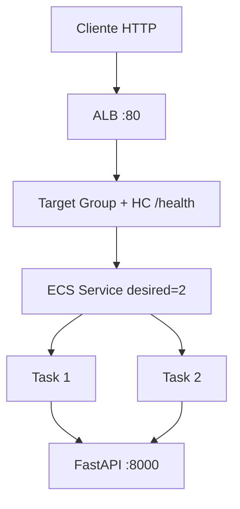

# Documento de Requisitos — Fase 2 (HA + ALB)

## Resumo da Intenção
- **Pedido**: Evoluir o lab da Fase 1 (FastAPI no Fargate) para arquitetura de alta disponibilidade didática com **ECS Service (desired=2)** + **Application Load Balancer** público, Target Group, health checks e demonstração de self-healing.
- **Tipo**: Enhancement / brownfield (infra + docs; app reutilizada).
- **Escopo**: Principalmente `infra/`, README/scripts/docs; app **intacta** (FastAPI).
- **Complexidade**: Moderada–alta (multi-AZ, ALB, SGs, service↔TG).
- **Profundidade**: Standard.
- **Idioma**: Português (pt-BR).

## Critérios de Aceite
1. API acessível via **DNS do ALB** (`http://<alb-dns>/` e `/health`).
2. ECS Service mantém **2 tasks** RUNNING.
3. ALB distribui requisições entre as tasks (Target Group).
4. Health checks do TG (`/health`) funcionando; targets unhealthy saem do balanceamento.
5. Encerrar **manualmente** 1 task → Service recria; ALB/TG se ajustam; app permanece disponível.
6. Checklist `terraform destroy` após o exercício (custo).

## Decisões Confirmadas (Q1–Q11)

| # | Tópico | Decisão |
|---|---|---|
| 1 | Framework | Manter **FastAPI** (não Flask) |
| 2 | Rede | **2 AZs** / 2 subnets públicas |
| 3 | TLS | Somente **HTTP :80** no ALB (sem ACM) |
| 4 | Tasks | Subnets públicas + `assign_public_ip = true` (sem NAT); **acesso HTTP principal só via ALB** |
| 5 | Health check TG | Path **`/health`**, porta **8000**, matcher 200 |
| 6 | Service | **desired_count = 2** + teste de matar 1 task |
| 7 | Repo | `infra/` + README/scripts/docs; **app intacta**; prefixo `hello-fargate` |
| 8 | Apply | Evoluir Terraform **in-place** (pode exigir destroy parcial / replace de rede) |
| 9 | Security Baseline | **Desabilitada** |
| 10 | Resiliency Baseline | **Habilitada** (direcional; HA/self-healing alinhados ao lab) |
| 11 | PBT | **Desabilitada** |

## Herdado da Fase 1 (ainda válido)
| Item | Valor |
|---|---|
| Região | `us-east-1` |
| Auth | AWS SSO |
| Fargate | 256 CPU / 512 MB |
| Build/push | `scripts/build-and-push.ps1` (não local-exec) |
| State | Local + comentário S3 futuro |
| API | `GET /` Hello World; `GET /health` JSON |
| Destroy | Checklist obrigatório |
| Processos org | Change management / incidentes = placeholders TBD (Fase 1) |

## Arquitetura alvo

```text
Internet
   ↓
ALB público (HTTP :80) — 2 AZs
   ↓
Target Group (protocol HTTP, port 8000, HC GET /health)
   ↓
ECS Service desired_count=2
   ├── Task 1 Fargate (AZ-a)
   └── Task 2 Fargate (AZ-b)
```



## Requisitos Funcionais

### RF-F2-01 — Reutilizar API
- Sem alterações significativas em `app/`; manter FastAPI + `/` e `/health`.

### RF-F2-02 — Rede multi-AZ
- VPC com **duas** subnets públicas em AZs distintas + IGW + rotas.
- Evoluir `network.tf` (in-place).

### RF-F2-03 — Application Load Balancer
- ALB **público**, listener **HTTP :80**.
- Encaminha ao Target Group.
- Output Terraform: `alb_dns_name` (fluxo principal do README).

### RF-F2-04 — Target Group e Health Checks
- Target type `ip` (awsvpc).
- Protocol/port HTTP **8000**.
- Health check path **`/health`**, sucesso HTTP 200.
- Integração com ECS Service (`load_balancer` block).

### RF-F2-05 — ECS Service HA
- `desired_count = 2`.
- Substituição automática de tasks (comportamento nativo do Service).
- Tasks em ambas as subnets/AZs.
- `assign_public_ip = true` (lab sem NAT).

### RF-F2-06 — Security Groups
- **SG ALB**: ingress 80 (CIDR configurável / default aberto documentado); egress para tasks.
- **SG tasks**: ingress **8000 somente a partir do SG do ALB** (não mais 8000 aberto ao mundo como caminho principal).
- Egress tasks: ECR pull + CloudWatch (como Fase 1).

### RF-F2-07 — Observabilidade
- Manter CloudWatch Logs da task (`/ecs/hello-fargate` ou equivalente).

### RF-F2-08 — Tooling / docs
- README: fluxo SSO → apply → build-and-push → **curl no DNS do ALB** → exercício self-healing → destroy.
- Atualizar guia didático (papel ALB, TG, Service vs task isolada).
- Atualizar policy IAM de estudo se faltar ação ELB (já parcial em `docs/`).

### RF-F2-09 — Cenário de validação self-healing
1. Acessar API pelo DNS do ALB.
2. Confirmar `/` e `/health`.
3. No console ECS, encerrar 1 task.
4. Observar: Service detecta desired&lt;running; nova task; TG deregistra unhealthy / registra nova após HC; app disponível.

## Requisitos Não Funcionais

### RNF-F2-01 — Custo
- Lab: 1 ALB + 2 tasks Fargate small; destroy obrigatório.
- Sem NAT Gateway (decisão Q4-A).

### RNF-F2-02 — Disponibilidade didática
- Objetivo: demonstrar HA/self-healing, **não** SLA de produção.
- HTTP sem TLS (Q3-A).

### RNF-F2-03 — Segurança operacional (mínima, Security OFF)
- Tráfego app via ALB; SG tasks restringe origem ao ALB.
- `allowed_cidr` no ALB:80 documentado (risco se 0.0.0.0/0).

### RNF-F2-04 — Clareza didática
- Explicar diferença: IP direto da task (Fase 1) vs DNS estável do ALB (Fase 2).

## Resiliency (extension ON) — postura Fase 2

| Área | Postura do lab |
|---|---|
| HA | 2 AZs + 2 tasks + ALB/TG |
| Self-healing | ECS Service + HC do TG (exercício obrigatório) |
| RTO/RPO | Ainda estudo: recreate via TF/redeploy; não DR multi-região |
| Change / incidentes | Placeholders org (Fase 1) |
| CI/CD | Continua fora de escopo (deploy manual) |

Várias práticas Well-Architected permanecem **N/A** ou “próximo passo” (multi-região, chaos formal, etc.).

## Compliance de Extensions

| Extension | Enabled | Notas |
|---|---|---|
| Security Baseline | No | Skip; SG mínimo didático apenas |
| Resiliency Baseline | Yes | HA/ALB/self-healing; demais N/A/placeholder |
| PBT | No | Skip |

## Backlog de implementação (alto nível)
1. Rede 2ª AZ + SGs ALB/tasks  
2. ALB + TG + listener + HC `/health`  
3. ECS Service desired=2 + `load_balancer`  
4. Outputs `alb_dns_name`; README/script/roteiro self-healing  
5. Policy IAM docs se necessário  
6. Build and Test + exercício matar task  

## Fora de escopo
- Rewrite Flask, HTTPS/ACM, NAT Gateway, autoscaling avançado, multi-região, CI/CD, ALB path-based avançado

## Próximo após aprovação
Workflow Planning (User Stories: avaliar skip — mudança infra/ops, pouco persona de produto).
