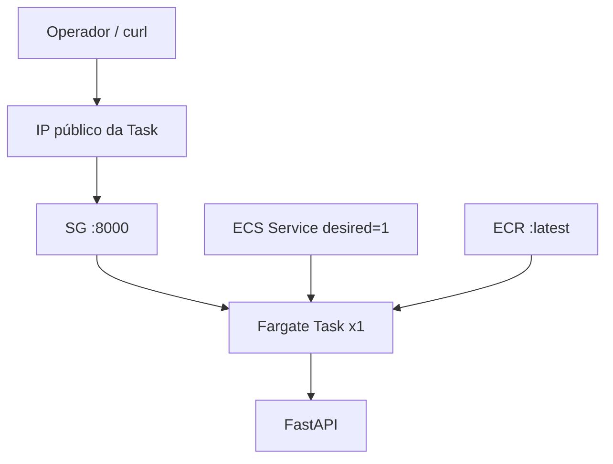

# Architecture — Fase 1 (estado atual)

## Visão

```text
Internet
   |
   v
Task Fargate (1x)  <-- IP público na ENI
   |  porta 8000
   |  SG task
   v
FastAPI (uvicorn)  GET /  GET /health
```

Não há ALB. O ECS Service já existe com `desired_count = 1` e `assign_public_ip = true` em **1 AZ**.

## Componentes AWS
| Componente | Uso na Fase 1 |
|---|---|
| VPC + subnet pública + IGW + RT | Rede mínima 1 AZ |
| Security Group (task) | Ingress TCP 8000 |
| ECR | Imagem `hello-fargate:latest` |
| ECS Cluster | `hello-fargate` |
| Task Definition | Fargate 256/512, awsvpc, logs |
| ECS Service | desired=1, sem `load_balancer {}` |
| CloudWatch Logs | `/ecs/hello-fargate` |
| IAM execution/task roles | Pull ECR + logs |

## Gaps vs Fase 2 (pedido)
- Sem ALB / Target Group / health check do ALB
- desired_count = 1 (pedido: 2)
- Acesso por IP da task (pedido: DNS do ALB)
- 1 AZ (HA típica pedirá ≥2 AZs para ALB/tasks)
- App é FastAPI, não Flask

## Diagrama Mermaid


