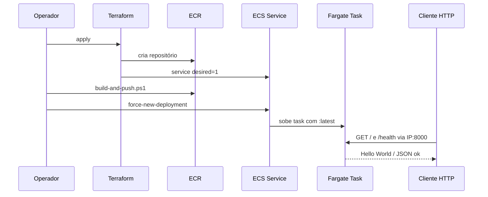

# Interaction Diagrams — Fase 1

## Deploy + request

## Self-healing na Fase 1
Com desired=1, se a única task cair, o Service tenta recriar — mas **sem ALB** o cliente que usava o IP antigo quebra até descobrir o novo IP.
